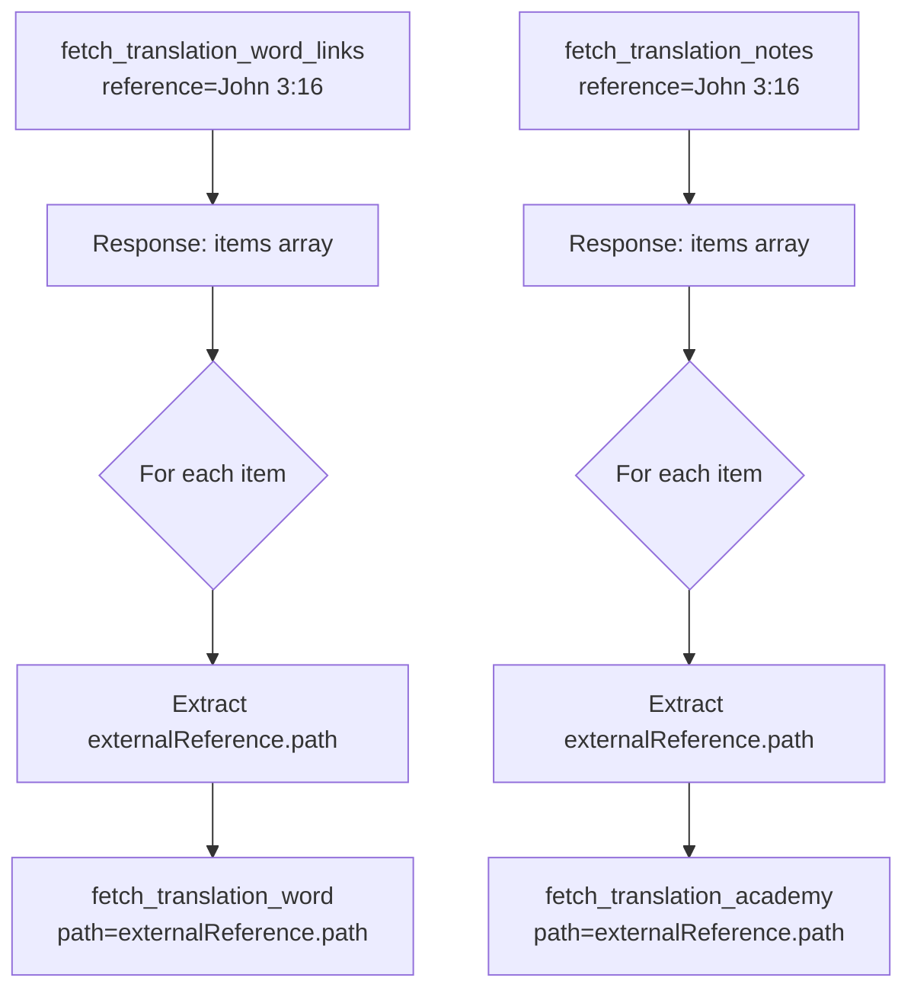

# MCP Prompt Parameter Fix

## Problem

The MCP prompts were instructing the AI to use **incorrect parameter names** when chaining tool calls together, causing cascading failures in multi-step workflows.

## Parameter Mismatches Fixed

### 1. Translation Word Fetching

**Tool**: `fetch_translation_word`
- **Expected Parameter**: `path` (e.g., `"bible/kt/love"`)
- **Prompt Was Using**: `term=<term_value>` ❌
- **Fixed To**: `path=<externalReference.path>` ✅

### 2. Translation Academy Fetching

**Tool**: `fetch_translation_academy`
- **Expected Parameter**: `path` (e.g., `"translate/figs-metaphor"`)
- **Prompt Was Using**: `rcLink=<supportReference_value>` ❌
- **Fixed To**: `path=<externalReference.path>` ✅

## Affected Prompts

### Prompt 1: `translation-helps-for-passage`

**Before:**
```
For EACH term in the response, use fetch_translation_word tool with term=<term_value>
```

**After:**
```
For EACH item that has externalReference.path, use fetch_translation_word tool with path=<externalReference.path>
```

**Before:**
```
For each supportReference, use fetch_translation_academy tool with rcLink=<supportReference_value>
```

**After:**
```
For each externalReference.path, use fetch_translation_academy tool with path=<path_value>
```

### Prompt 2: `get-translation-words-for-passage`

**Before:**
```
For EACH term in the links result, call fetch_translation_word with term=<term_value>
```

**After:**
```
For EACH item that has externalReference.path, call fetch_translation_word with path=<externalReference.path>
```

### Prompt 3: `get-translation-academy-for-passage`

**Before:**
```
For each supportReference, use fetch_translation_academy tool
If it's an RC link: use rcLink=<supportReference_value>
If it's a moduleId: use moduleId=<supportReference_value>
```

**After:**
```
For each externalReference.path, use fetch_translation_academy tool with path=<path_value>
```

## Response Structure Reference

### fetch_translation_word_links Response
```json
{
  "items": [
    {
      "id": "twl1",
      "reference": "John 3:16",
      "occurrence": 1,
      "quote": "loved",
      "strongsId": "G25",
      "externalReference": {
        "target": "tw",
        "path": "bible/kt/love",
        "category": "kt"
      }
    }
  ]
}
```

### fetch_translation_notes Response
```json
{
  "items": [
    {
      "Reference": "3:16",
      "ID": "abc123",
      "Note": "...",
      "Quote": "loved",
      "externalReference": {
        "target": "ta",
        "path": "translate/figs-metaphor"
      }
    }
  ]
}
```

## Correct Tool Parameter Usage

| Tool | Correct Parameter | Format | Example |
|------|-------------------|--------|---------|
| `fetch_scripture` | `reference` | "BOOK C:V" | "John 3:16" |
| `fetch_translation_questions` | `reference` | "BOOK C:V" | "John 3:16" |
| `fetch_translation_word_links` | `reference` | "BOOK C:V" | "John 3:16" |
| `fetch_translation_word` | `path` | "bible/category/term" | "bible/kt/love" |
| `fetch_translation_notes` | `reference` | "BOOK C:V" | "John 3:16" |
| `fetch_translation_academy` | `path` | "section/module" | "translate/figs-metaphor" |

## Workflow Chain (Corrected)



## Testing

After restarting the dev server, test the "translation-helps-for-passage" prompt with "John 3:16". It should now:

1. ✅ Fetch scripture successfully
2. ✅ Fetch translation questions successfully
3. ✅ Fetch translation word links successfully
4. ✅ Fetch each translation word using `path` from `externalReference.path`
5. ✅ Fetch translation notes successfully
6. ✅ Fetch academy articles using `path` from `externalReference.path`

Expected workflow time: 
- **Cold start**: ~5-10s (multiple sequential tool calls)
- **Cached**: ~2-3s (most data cached)

## Files Modified

- `src/mcp/prompts-registry.ts` - Fixed parameter names in all affected prompts
- `src/services/ZipResourceFetcher2.ts` - Added `topic` parameter support
- `src/services/LocalZipFetcher.ts` - Added `topic` parameter support
- `src/services/zip-fetcher-provider.ts` - Updated interface

---

**Status**: ✅ Fixed - Restart dev server to apply
**Impact**: Enables multi-step prompt workflows to execute correctly
**Risk**: 🟢 Low - Parameter names now match tool definitions
